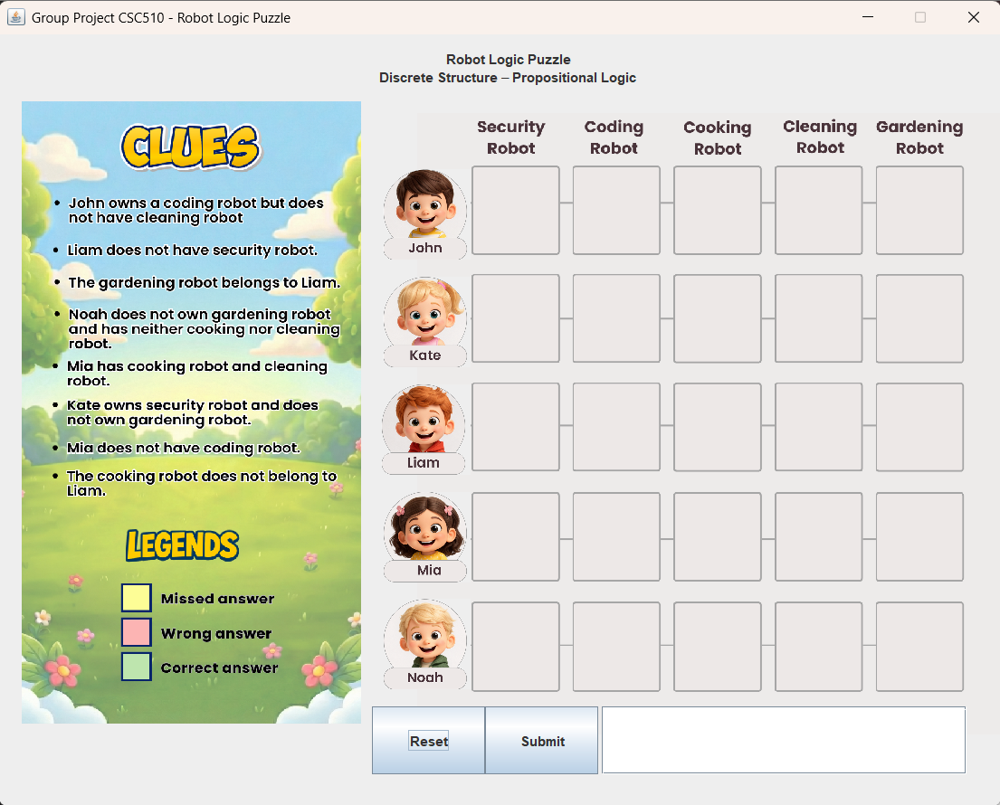
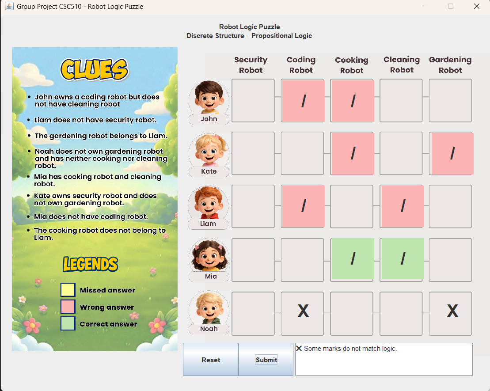

## Robot Puzzle Challenge

This project is developed as part of the **CSC510 - Discrete Structures** course. It implements a **logic-based robot puzzle** using Java.

### 🧩 Project Description
----------------------------
The Robot Puzzle Challenge is a logic-based puzzle implemented using **Java**.  
The puzzle involves multiple characters and a set of constraints that must be satisfied in order to reach the correct solution.

The main purpose of this project is:
- Apply logical reasoning learned in CSC510
- Translate abstract constraints into program logic
- Visualize the problem using a graphical interface

### ▶️ How to Run the Program
----------------------------
1. Open the project in Visual Studio Code
2. Make sure Java JDK is installed
3. Run 'LogicPuzzleGUI.java'

### ▶️ Screenshots
----------------------------
#### Main Interface

#### Puzzle Interaction

### 📌 Notes
----------------------------
This project is created for **academic purposes** as part of the CSC510 coursework.